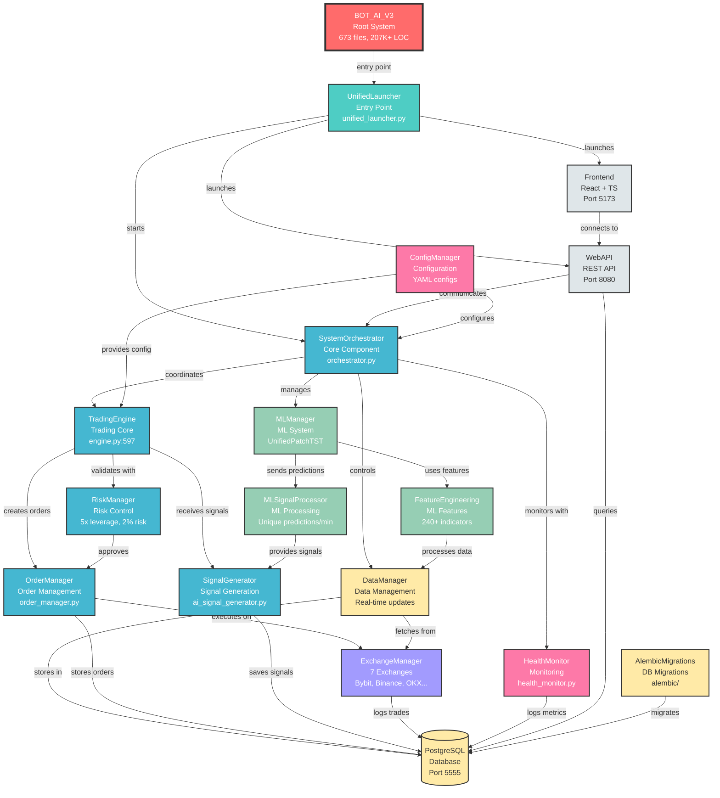

# Архитектура проекта BOT_AI_V3

## Граф структуры системы

## Описание компонентов

### 🔴 Root System

- **BOT_AI_V3**: Главная система алгоритмической торговли криптовалютами
  - 673 файла, 207K+ строк кода
  - Python 3.8+, PostgreSQL 15+
  - Поддержка 7 бирж
  - ML модель UnifiedPatchTST с 240+ признаками

### 🟢 Entry Point & Orchestration

- **UnifiedLauncher**: Точка входа системы (unified_launcher.py)
  - Запуск всех процессов
  - Управление режимами (core, api, ml)

- **SystemOrchestrator**: Координация компонентов (core/system/orchestrator.py)
  - Управление жизненным циклом
  - Синхронизация модулей

### 🔵 Trading Core

- **TradingEngine**: Основная торговая логика (trading/engine.py:597)
  - Обработка сигналов
  - Управление ордерами

- **OrderManager**: Управление ордерами (trading/orders/order_manager.py)
  - Создание и исполнение ордеров
  - Интеграция SL/TP
  - Hedge mode

- **RiskManager**: Контроль рисков (risk_management/manager.py)
  - Кредитное плечо 5x
  - Лимит риска 2%
  - Расчет размера позиций

### 🟣 ML System

- **MLManager**: Управление ML моделями (ml/ml_manager.py)
  - UnifiedPatchTST модель
  - GPU оптимизация (RTX 5090)

- **MLSignalProcessor**: Обработка предсказаний (ml/ml_signal_processor.py)
  - Уникальные предсказания/минута
  - Кэширование с TTL 5 минут

- **FeatureEngineering**: Инженерия признаков (ml/logic/feature_engineering_v2.py)
  - 240+ технических индикаторов
  - Обработка OHLCV данных

### 🟡 Data Layer

- **DataManager**: Управление данными (core/system/data_manager.py)
  - Real-time обновления
  - Кэширование

- **PostgreSQL**: База данных (порт 5555)
  - Хранение ордеров, сделок, сигналов
  - ML предсказания
  - Рыночные данные

### 🟠 Exchange Integration

- **ExchangeManager**: Интеграция с биржами (exchanges/exchange_manager.py)
  - 7 бирж: Bybit, Binance, OKX, Gate.io, KuCoin, HTX, BingX
  - API и WebSocket подключения

### ⚪ Web Interface

- **WebAPI**: REST API (web/api/main.py)
  - Порт 8080
  - WebSocket для real-time
  - API документация /api/docs

- **Frontend**: Пользовательский интерфейс (web/frontend/)
  - React + TypeScript
  - Порт 5173
  - Real-time мониторинг

### 🔧 Utilities

- **ConfigManager**: Управление конфигурацией
  - YAML конфигурации
  - Environment переменные

- **HealthMonitor**: Мониторинг системы
  - Проверка компонентов
  - Метрики производительности

- **AlembicMigrations**: Миграции БД
  - Версионирование схемы
  - Автоматические миграции

## Поток данных

1. **Запуск**: BOT_AI_V3 → UnifiedLauncher → SystemOrchestrator
2. **Сбор данных**: ExchangeManager → DataManager → PostgreSQL
3. **ML обработка**: DataManager → FeatureEngineering → MLManager → MLSignalProcessor
4. **Генерация сигналов**: MLSignalProcessor → SignalGenerator → TradingEngine
5. **Исполнение**: TradingEngine → RiskManager → OrderManager → ExchangeManager
6. **Мониторинг**: HealthMonitor → PostgreSQL, WebAPI → Frontend

## Ключевые особенности

- **Масштаб**: 673 файла, 207K+ строк кода
- **Производительность**: GPU оптимизация, async операции
- **Надежность**: Risk management, health monitoring
- **Гибкость**: 7 бирж, 50+ торговых пар
- **ML**: UnifiedPatchTST модель, 240+ признаков
- **Real-time**: WebSocket подключения, live мониторинг
