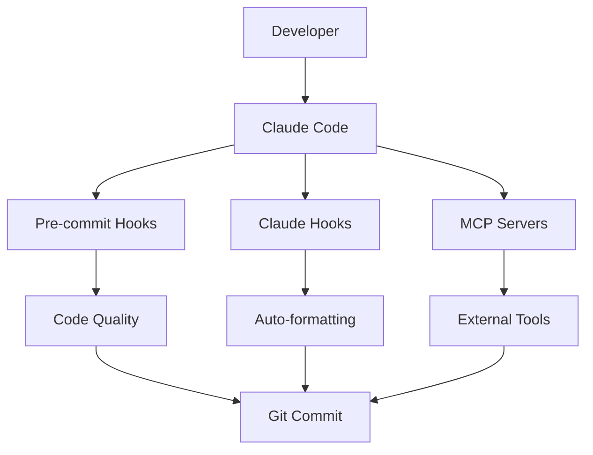

# 📚 Complete Development Setup для BOT_AI_V3

Полная документация по настройке окружения разработки с автоматизацией через Claude Code и pre-commit хуки.

## 📋 Оглавление

1. [Обзор системы](#обзор-системы)
2. [Pre-commit хуки](#pre-commit-хуки)
3. [Claude Code хуки](#claude-code-хуки)
4. [MCP серверы](#mcp-серверы)
5. [GitHub интеграция](#github-интеграция)
6. [Структура проекта](#структура-проекта)
7. [Команды и скрипты](#команды-и-скрипты)
8. [Troubleshooting](#troubleshooting)

## 🎯 Обзор системы

### Компоненты автоматизации



### Ключевые возможности

- **Автоматическое форматирование** кода при каждом изменении
- **Проверка качества** перед коммитом
- **Защита от опасных операций**
- **Интеграция с внешними сервисами** через MCP
- **Контекстные подсказки** на основе анализа кода
- **Логирование всех операций** для анализа

## 🔧 Pre-commit хуки

### Установка

```bash
# Запустите скрипт установки
bash scripts/setup_pre_commit.sh

# Или вручную
pip install pre-commit
pre-commit install
pre-commit install --hook-type commit-msg
```

### Конфигурация (.pre-commit-config.yaml)

#### Python хуки

- **Black** - форматирование (100 символов в строке)
- **isort** - сортировка импортов
- **Ruff** - быстрый линтер с автоисправлением
- **MyPy** - проверка типов
- **Bandit** - поиск уязвимостей

#### JavaScript/TypeScript хуки

- **ESLint** - линтинг и форматирование
- **Prettier** - форматирование (через ESLint)

#### Другие проверки

- **yamllint** - валидация YAML
- **markdownlint** - проверка Markdown
- **sqlfluff** - форматирование SQL
- **detect-secrets** - поиск секретов
- **commitizen** - валидация commit message

### Использование

```bash
# Ручной запуск всех проверок
pre-commit run --all-files

# Проверка конкретного хука
pre-commit run black --files main.py

# Обновление версий хуков
pre-commit autoupdate

# Обход хуков (не рекомендуется!)
git commit --no-verify -m "emergency fix"
```

## 🎣 Claude Code хуки

### Структура хуков

```text
.claude/
├── settings.json          # Основная конфигурация
├── hooks/                 # Python-скрипты хуков
│   ├── user_prompt_submit.py
│   ├── pre_tool_use.py
│   ├── post_tool_use.py
│   ├── notification.py
│   └── stop.py
├── commands/              # Слэш-команды
│   ├── check-quality.md
│   ├── optimize-strategy.md
│   ├── fix-issue.md
│   └── deploy-check.md
└── logs/                  # Логи работы
    ├── prompts.jsonl
    ├── tool_use.jsonl
    ├── notifications.jsonl
    └── sessions.jsonl
```

### События хуков

#### 1. UserPromptSubmit

- Срабатывает при вводе команды пользователем
- Логирует запросы
- Предоставляет контекстные подсказки

#### 2. PreToolUse

- Перед использованием инструмента
- Блокирует опасные операции
- Валидирует параметры

#### 3. PostToolUse

- После успешного выполнения инструмента
- Автоформатирование кода
- Запуск проверок

#### 4. Notification

- При получении уведомлений
- Логирование
- Дополнительный контекст

#### 5. Stop

- При завершении сессии
- Сводка изменений
- Напоминания

### Переменные окружения

```bash
CLAUDE_PROMPT         # Текст пользовательского запроса
CLAUDE_TOOL_NAME      # Имя используемого инструмента
CLAUDE_TOOL_PARAMS    # Параметры инструмента (JSON)
CLAUDE_PROJECT_DIR    # Путь к корню проекта
CLAUDE_NOTIFICATION   # Текст уведомления
CLAUDE_FILE_PATHS     # Пути к файлам (для PostToolUse)
```

### Слэш-команды

```bash
/check-quality        # Проверка качества кода
/optimize-strategy    # Оптимизация стратегии
/fix-issue           # Исправление GitHub issue
/deploy-check        # Проверка готовности к деплою
```

## 🔌 MCP серверы

### Конфигурация (.mcp.json)

```json
{
  "mcpServers": {
    "filesystem": {
      "command": "npx",
      "args": ["@modelcontextprotocol/server-filesystem", "./"]
    },
    "postgres": {
      "command": "npx",
      "args": ["mcp-postgres-server"],
      "env": {
        "PGHOST": "${PGHOST}",
        "PGPORT": "${PGPORT}",
        "PGUSER": "${PGUSER}",
        "PGPASSWORD": "${PGPASSWORD}",
        "PGDATABASE": "${PGDATABASE}"
      }
    },
    "puppeteer": {
      "command": "npx",
      "args": ["@modelcontextprotocol/server-puppeteer"]
    },
    "sequential-thinking": {
      "command": "npx",
      "args": ["@modelcontextprotocol/server-sequential-thinking"]
    },
    "memory": {
      "command": "npx",
      "args": ["@modelcontextprotocol/server-memory"]
    },
    "github": {
      "command": "npx",
      "args": ["@modelcontextprotocol/server-github"],
      "env": {
        "GITHUB_TOKEN": "${GITHUB_TOKEN}"
      }
    }
  }
}
```

### Установка MCP серверов

```bash
# В корне проекта
npm install

# Проверка подключения
claude-code mcp list
```

## 🐙 GitHub интеграция

### GitHub Actions

#### 1. AI Code Review (.github/workflows/ai_code_review.yml)

- Автоматический код-ревью при PR
- Реагирование на команды в комментариях
- Архитектурный анализ

#### 2. Claude Code CI (.github/workflows/claude.yml)

- Автоматические тесты
- Проверка качества кода
- Деплой документации

### Команды в PR

```bash
@claude review file.py        # Ревью файла
@claude test file.py          # Генерация тестов
@claude optimize file.py      # Оптимизация
@claude security path/        # Аудит безопасности
@claude implement <feature>   # Реализация фичи
@claude usage                 # Статистика токенов
```

## 📁 Структура проекта

### Ключевые директории

```text
BOT_AI_V3/
├── .claude/              # Конфигурация Claude Code
├── .github/              # GitHub Actions и шаблоны
├── ai_agents/            # AI агенты и интеграции
├── core/                 # Ядро системы
├── strategies/           # Торговые стратегии
├── exchanges/            # Интеграции с биржами
├── web/                  # Веб-интерфейс
├── tests/                # Тесты
├── docs/                 # Документация
└── scripts/              # Вспомогательные скрипты
```

### Важные файлы конфигурации

- `.env` - переменные окружения (не в git!)
- `.pre-commit-config.yaml` - настройка pre-commit
- `.mcp.json` - конфигурация MCP серверов
- `.claude/settings.json` - настройки Claude Code
- `setup.py` - конфигурация пакета
- `requirements.txt` - Python зависимости
- `package.json` - Node.js зависимости

## 🚀 Команды и скрипты

### Разработка

```bash
# Запуск основного приложения
python main.py

# Запуск веб-интерфейса
python web/launcher.py --reload --debug

# Запуск тестов
pytest tests/ -v --cov=src/

# Проверка качества кода
pre-commit run --all-files

# Форматирование Python кода
black . && isort . && ruff check . --fix

# Проверка типов
mypy src/
```

### AI агенты

```bash
# Кросс-верификация
python -m ai_agents.cross_verification --task="описание задачи"

# Генерация тестов
python -m ai_agents.test_generator --class=TradingEngine

# Код-ревью
python -m ai_agents.code_reviewer --file=trading/engine.py
```

### Утилиты

```bash
# Синхронизация с сервером
bash scripts/sync_to_linux_server.sh

# Установка pre-commit
bash scripts/setup_pre_commit.sh

# Ротация API ключей
python -m scripts.rotate_api_keys --exchange=bybit
```

## 🔍 Troubleshooting

### Pre-commit проблемы

#### Ошибка detect-secrets

```bash
# Пересоздать baseline
detect-secrets scan > .secrets.baseline
```

#### Ошибка ESLint

```bash
cd web/frontend
npm install
npx eslint --init
```

#### Ошибка форматирования

```bash
# Принять все автоисправления
pre-commit run --all-files
git add -A
```

### Claude Code проблемы

#### Хуки не работают

1. Проверьте права на выполнение: `chmod +x .claude/hooks/*.py`
2. Проверьте пути в settings.json
3. Посмотрите логи: `tail -f .claude/logs/*.jsonl`

#### MCP сервер не подключается

1. Проверьте установку: `npm list | grep mcp`
2. Проверьте переменные окружения в .env
3. Перезапустите Claude Code

### Git проблемы

#### Большой размер коммита

```bash
# Проверить большие файлы
git rev-list --objects --all | grep -E "$(git verify-pack -v .git/objects/pack/*.idx | sort -k 3 -n | tail -10 | awk '{print$1}')"

# Очистить историю (осторожно!)
git filter-branch --tree-filter 'rm -rf path/to/large/file' HEAD
```

## 📈 Мониторинг и аналитика

### Просмотр логов Claude

```bash
# Статистика использования инструментов
jq -s 'group_by(.tool) | map({tool: .[0].tool, count: length})' .claude/logs/tool_use.jsonl

# Частые запросы
jq -r '.prompt' .claude/logs/prompts.jsonl | sort | uniq -c | sort -nr | head -20

# Ошибки
grep -i error .claude/logs/*.jsonl
```

### Git статистика

```bash
# Активность по дням
git log --format="%ad" --date=short | sort | uniq -c

# Топ контрибьюторов
git shortlog -sn

# Изменения по файлам
git log --pretty=format: --name-only | sort | uniq -c | sort -rg | head -20
```

## 🎓 Best Practices

1. **Всегда используйте pre-commit** - не обходите проверки
2. **Пишите понятные commit message** - следуйте conventional commits
3. **Документируйте изменения** - обновляйте README и docs
4. **Тестируйте перед push** - запускайте тесты локально
5. **Используйте слэш-команды** - для повторяющихся задач
6. **Проверяйте логи** - для выявления проблем
7. **Обновляйте зависимости** - регулярно запускайте updates

## 🔗 Полезные ссылки

- [Claude Code документация](https://docs.anthropic.com/en/docs/claude-code)
- [Pre-commit документация](https://pre-commit.com/)
- [MCP протокол](https://github.com/modelcontextprotocol)
- [Conventional Commits](https://www.conventionalcommits.org/)

---

*Документация обновлена: Июль 2025*
