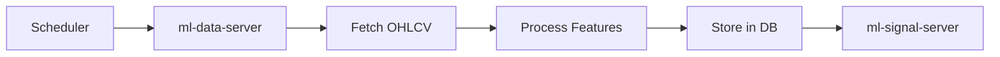
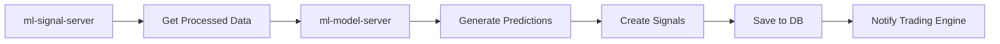

# 🔧 MCP Integration Plan для ML System

## Обзор

План интеграции MCP (Model Context Protocol) серверов для автоматизации ML pipeline в BOT_AI_V3.

## 📦 MCP Серверы для ML

### 1. ml-data-server

**Назначение**: Управление потоком данных для ML системы
**Функции**:

- Автоматическая загрузка OHLCV данных
- Валидация качества данных
- Управление кешем обработанных данных
- API для доступа к историческим данным

**Ресурсы**:

```json
{
  "name": "ml-data-server",
  "resources": [
    {
      "uri": "ml://data/ohlcv/{symbol}",
      "name": "OHLCV Data",
      "mimeType": "application/json"
    },
    {
      "uri": "ml://data/processed/{symbol}",
      "name": "Processed Features",
      "mimeType": "application/json"
    },
    {
      "uri": "ml://data/stats",
      "name": "Data Statistics",
      "mimeType": "application/json"
    }
  ]
}
```

**Tools**:

- `fetch_ohlcv` - загрузка данных с биржи
- `process_features` - обработка и генерация признаков
- `validate_data` - проверка качества данных
- `cleanup_old_data` - очистка устаревших данных

### 2. ml-signal-server

**Назначение**: Генерация и управление торговыми сигналами
**Функции**:

- Real-time генерация сигналов
- Управление очередью предсказаний
- Фильтрация и валидация сигналов
- Исторический анализ сигналов

**Ресурсы**:

```json
{
  "name": "ml-signal-server",
  "resources": [
    {
      "uri": "ml://signals/active",
      "name": "Active Signals",
      "mimeType": "application/json"
    },
    {
      "uri": "ml://signals/history/{symbol}",
      "name": "Signal History",
      "mimeType": "application/json"
    },
    {
      "uri": "ml://signals/performance",
      "name": "Signal Performance",
      "mimeType": "application/json"
    }
  ]
}
```

**Tools**:

- `generate_signal` - генерация сигнала для символа
- `batch_generate` - пакетная генерация для списка символов
- `evaluate_signal` - оценка качества сигнала
- `get_signal_stats` - статистика по сигналам

### 3. ml-model-server

**Назначение**: Управление ML моделями
**Функции**:

- Загрузка и кеширование моделей
- A/B тестирование моделей
- Мониторинг производительности
- Hot-reload новых версий

**Ресурсы**:

```json
{
  "name": "ml-model-server",
  "resources": [
    {
      "uri": "ml://models/active",
      "name": "Active Model",
      "mimeType": "application/json"
    },
    {
      "uri": "ml://models/versions",
      "name": "Model Versions",
      "mimeType": "application/json"
    },
    {
      "uri": "ml://models/metrics",
      "name": "Model Metrics",
      "mimeType": "application/json"
    }
  ]
}
```

**Tools**:

- `load_model` - загрузка модели
- `predict` - получение предсказания
- `compare_models` - сравнение версий
- `rollback_model` - откат к предыдущей версии

## 🔄 Workflow интеграции

### 1. Data Pipeline (каждую минуту)



### 2. Signal Generation Pipeline



### 3. Model Management Pipeline


## 📝 Конфигурация MCP

### Обновление .mcp.json

```json
{
  "mcpServers": {
    "ml-data-server": {
      "command": "node",
      "args": ["./mcp-servers/ml-data-server/index.js"],
      "env": {
        "DATABASE_URL": "postgresql://obertruper@:5555/bot_trading_v3",
        "REDIS_URL": "redis://localhost:6379"
      }
    },
    "ml-signal-server": {
      "command": "node",
      "args": ["./mcp-servers/ml-signal-server/index.js"],
      "env": {
        "MODEL_PATH": "./ml/models/best_model_20250728_215703.pth",
        "BATCH_SIZE": "50"
      }
    },
    "ml-model-server": {
      "command": "node",
      "args": ["./mcp-servers/ml-model-server/index.js"],
      "env": {
        "MODELS_DIR": "./ml/models",
        "CACHE_SIZE": "5"
      }
    }
  }
}
```

## 🚀 Реализация

### Phase 1: Базовая инфраструктура

1. **Создание MCP серверов**
   - Базовая структура Node.js проектов
   - Подключение к PostgreSQL и Redis
   - Реализация основных endpoints

2. **Интеграция с существующим кодом**
   - Обертки для Python компонентов
   - Async communication через Redis
   - Error handling и logging

### Phase 2: Core функционал

1. **ml-data-server**
   - Интеграция с DataLoader
   - Scheduled tasks для обновления данных
   - REST API для доступа к данным

2. **ml-signal-server**
   - Интеграция с MLSignalGenerator
   - WebSocket для real-time сигналов
   - Performance tracking

3. **ml-model-server**
   - Model registry
   - Version control
   - Performance metrics

### Phase 3: Продвинутые возможности

1. **Автоматизация**
   - Auto-scaling based on load
   - Automatic model retraining
   - Anomaly detection

2. **Мониторинг**
   - Prometheus metrics export
   - Custom Grafana dashboards
   - Alert rules

3. **Оптимизация**
   - Model quantization
   - Batch prediction optimization
   - Cache strategies

## 📊 Метрики и KPI

### Performance Metrics

- **Latency**: < 50ms для single prediction
- **Throughput**: > 1000 predictions/sec
- **Availability**: 99.9% uptime

### ML Metrics

- **Model accuracy**: Track F1, precision, recall
- **Signal quality**: Win rate, profit factor
- **Drift detection**: Feature and prediction drift

### System Metrics

- **Resource usage**: CPU, Memory, GPU
- **Queue lengths**: Processing backlog
- **Error rates**: Failed predictions

## 🛠 Инструменты разработки

### Development

```bash
# Запуск MCP серверов локально
npm run dev:ml-data-server
npm run dev:ml-signal-server
npm run dev:ml-model-server

# Тестирование
npm test
npm run test:integration

# Мониторинг
docker-compose up prometheus grafana
```

### Debugging

```bash
# Просмотр логов
claude-code mcp logs ml-data-server
claude-code mcp logs ml-signal-server

# Проверка статуса
claude-code mcp status

# Перезапуск серверов
claude-code mcp restart ml-signal-server
```

## 📅 Timeline

### Week 1

- [ ] Создание базовой структуры MCP серверов
- [ ] Интеграция ml-data-server с DataLoader
- [ ] Базовые endpoints и тесты

### Week 2

- [ ] ml-signal-server implementation
- [ ] ml-model-server implementation
- [ ] Integration testing

### Week 3

- [ ] Performance optimization
- [ ] Monitoring setup
- [ ] Production deployment

## 🔐 Security

### API Security

- JWT authentication для внешних запросов
- Rate limiting
- Input validation

### Data Security

- Encryption at rest
- Secure model storage
- Audit logging

### Network Security

- TLS для всех соединений
- Firewall rules
- VPN для production access

## 📚 Документация

### API Documentation

- OpenAPI specs для каждого сервера
- Postman collections
- Example requests

### Developer Guide

- Setup instructions
- Architecture overview
- Troubleshooting guide

### Operations Guide

- Deployment procedures
- Monitoring setup
- Incident response

---

*Version: 1.0.0*
*Last Updated: 02.08.2025*
