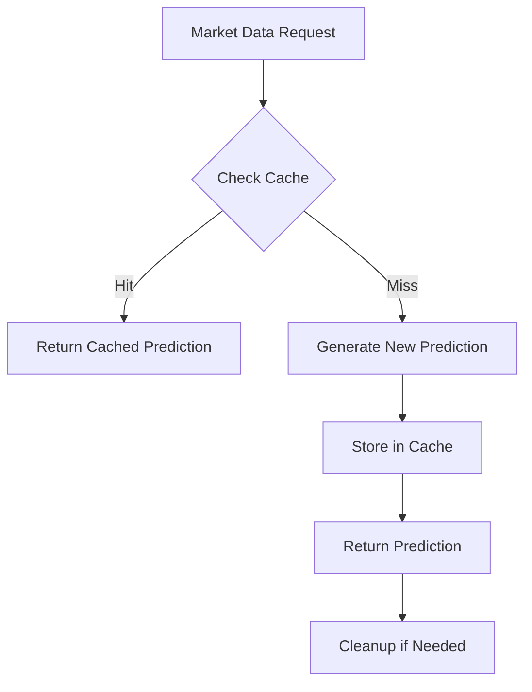

# ML Prediction Cache System Documentation

## 📊 Overview

The ML prediction cache system ensures efficient and unique predictions for each trading symbol while minimizing computational overhead.

## 🔑 Cache Key Generation

### Enhanced Cache Key Format
```python
cache_key = f"{exchange}:{symbol}:{timestamp}:{data_hash}"
```

### Components:
- **exchange**: Trading exchange (e.g., "bybit")
- **symbol**: Trading pair (e.g., "BTCUSDT")
- **timestamp**: Current time with second precision (YYYYMMDDHHmmss)
- **data_hash**: MD5 hash of last 3 closing prices (8 chars)

### Example:
```python
"bybit:BTCUSDT:20250820143052:a3f2b8c1"
```

## 🎯 Key Features

### 1. Unique Predictions per Symbol
Each symbol receives unique ML predictions even when processed simultaneously:
```python
# Different symbols = different cache keys = different predictions
BTCUSDT → unique prediction
ETHUSDT → unique prediction  
SOLUSDT → unique prediction
```

### 2. Data-Aware Caching
The cache key includes a data hash to ensure predictions update when market data changes:
```python
# Hash calculation
last_closes = ohlcv_data.tail(3)['close'].values
data_hash = hashlib.md5(str(last_closes).encode()).hexdigest()[:8]
```

### 3. TTL Management
- **Default TTL**: 300 seconds (5 minutes)
- Aligns with ML model update frequency
- Automatic cleanup of expired entries

## 📈 Cache Statistics

### Metrics Tracked
```python
cache_stats = {
    "hits": 150,              # Cache hits count
    "misses": 50,             # Cache misses count
    "hit_rate": 0.75,         # 75% hit rate
    "cache_size": 42,         # Current entries
    "unique_symbols": 10,     # Unique symbols processed
    "symbols_list": [...],    # List of symbols
    "cache_ttl_seconds": 300, # TTL setting
    "last_cleanup": "2025-08-20T14:30:00"
}
```

### Accessing Metrics
```python
processor = MLSignalProcessor(...)
metrics = processor.get_cache_metrics()
print(f"Cache hit rate: {metrics['cache_hit_rate']:.1%}")
```

## 🧹 Cache Cleanup

### Automatic Cleanup Triggers
1. **TTL Expiration**: Entries older than 300 seconds
2. **Size Limit**: When cache exceeds 1000 entries
3. **Invalid Data**: Entries without valid timestamps

### Cleanup Process
```python
def _cleanup_cache(self):
    # 1. Remove expired entries
    for key, data in self.prediction_cache.items():
        if is_expired(data):
            del self.prediction_cache[key]
    
    # 2. Enforce size limit (keep newest 1000)
    if len(self.prediction_cache) > 1000:
        sorted_items = sorted_by_timestamp(...)
        remove_oldest(...)
```

## 🔄 Cache Flow



## ⚙️ Configuration

### Recommended Settings
```yaml
# config/ml/ml_config.yaml
ml:
  cache:
    enabled: true
    ttl_seconds: 300        # 5 minutes
    max_size: 1000          # Maximum entries
    cleanup_interval: 60    # Cleanup check every minute
    enable_stats: true      # Track statistics
```

### Performance Tuning
| Parameter | Default | Range | Impact |
|-----------|---------|-------|--------|
| TTL | 300s | 60-600s | Freshness vs Performance |
| Max Size | 1000 | 100-5000 | Memory vs Coverage |
| Cleanup Interval | 60s | 30-300s | Memory vs CPU |

## 📊 Monitoring

### Key Metrics to Watch
1. **Hit Rate**: Should be > 60% for efficiency
2. **Cache Size**: Should stay below max_size
3. **Unique Symbols**: Should match active trading pairs
4. **Cleanup Frequency**: Should not exceed 1/minute

### Warning Signs
- ⚠️ Hit rate < 40%: TTL might be too short
- ⚠️ Cache size at max: Consider increasing limit
- ⚠️ Frequent cleanups: Possible memory pressure
- ⚠️ Same predictions: Check data hash generation

## 🐛 Troubleshooting

### Issue: All symbols getting same predictions
**Solution**: Verify cache key includes symbol and data hash
```python
# Check cache keys are unique
assert cache_key_btc != cache_key_eth
```

### Issue: Low cache hit rate
**Solution**: Increase TTL or check prediction frequency
```yaml
cache:
  ttl_seconds: 600  # Increase to 10 minutes
```

### Issue: Memory usage growing
**Solution**: Reduce max_size or decrease TTL
```yaml
cache:
  max_size: 500     # Reduce cache size
  ttl_seconds: 180  # Shorter TTL
```

## 📝 API Endpoints

### Get Cache Statistics
```http
GET /api/ml/cache-stats

Response:
{
  "cache_hits": 1500,
  "cache_misses": 500,
  "cache_hit_rate": 0.75,
  "cache_size": 42,
  "unique_symbols_processed": 10,
  "cache_ttl_seconds": 300,
  "last_cleanup": "2025-08-20T14:30:00Z"
}
```

### Clear Cache
```http
POST /api/ml/cache/clear

Response:
{
  "status": "success",
  "cleared_entries": 42
}
```

## 🔍 Cache Key Examples

### Different Symbols (Unique Predictions)
```
bybit:BTCUSDT:20250820143052:a3f2b8c1 → Prediction A
bybit:ETHUSDT:20250820143052:b4g3d9e2 → Prediction B
bybit:SOLUSDT:20250820143052:c5h4e0f3 → Prediction C
```

### Same Symbol, Different Times
```
bybit:BTCUSDT:20250820143052:a3f2b8c1 → Prediction A
bybit:BTCUSDT:20250820143152:a3f2b8c1 → Cache Hit (within TTL)
bybit:BTCUSDT:20250820143652:d6i5f1g4 → New Prediction (TTL expired)
```

### Same Symbol, Different Data
```
bybit:BTCUSDT:20250820143052:a3f2b8c1 → Prediction A (price: 45000)
bybit:BTCUSDT:20250820143053:e7j6g2h5 → Prediction B (price: 45100)
```

## ✅ Best Practices

1. **Monitor Hit Rate**: Aim for 60-80% hit rate
2. **Regular Cleanup**: Let automatic cleanup handle memory
3. **Symbol Diversity**: Verify all symbols get unique predictions
4. **TTL Alignment**: Match TTL with prediction update frequency
5. **Stats Logging**: Enable stats for production monitoring

## 📚 Related Documentation

- [ML System Overview](ML_SYSTEM.md)
- [ML Direction Classes Fix](ML_DIRECTION_CLASSES_FIX.md)
- [ML Signal Processor](../ml/ml_signal_processor.py)
- [ML Troubleshooting](ML_TROUBLESHOOTING.md)