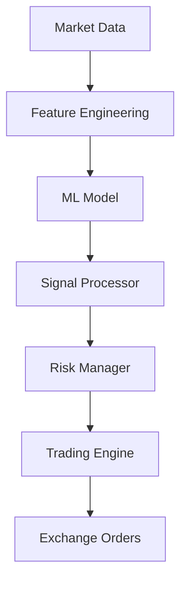

# ML Trading System Documentation - BOT_AI_V3

## System Architecture

```
ML Trading Pipeline
├── Data Collection (DataLoader)
├── Feature Engineering (FeatureEngineer)
├── Real-time Processing (RealTimeIndicatorCalculator)
├── ML Inference (MLManager + UnifiedPatchTST)
├── Signal Generation (MLSignalProcessor)
└── Trade Execution (TradingEngine)
```

## Core Components

### 1. MLManager (`ml/ml_manager.py`)

Central ML system coordinator handling model loading, inference, and predictions.

#### Key Features

- **Model**: UnifiedPatchTST (Transformer-based)
- **Input**: 96 timesteps × 240 features
- **Output**: 20 predictions (returns, directions, risks)
- **Inference Time**: <20ms on GPU

#### Configuration

```yaml
# config/ml/ml_config.yaml
model:
  type: "unified_patchtst"
  version: "latest"
  path: "models/unified_patchtst_model.pth"

inference:
  batch_size: 32
  device: "cuda"  # or "cpu"
  fp16: true      # Half precision for speed

features:
  count: 240
  lookback: 96    # 24 hours of 15-min candles
```

### 2. Feature Engineering (`ml/logic/feature_engineering_v2.py`)

Creates 240+ technical indicators and ML features from OHLCV data.

#### Feature Pipeline

```python
# 1. Load raw OHLCV data
df = load_market_data(symbol, timeframe="15m")

# 2. Create features
fe = FeatureEngineer(config)
features_df = fe.create_features(df)

# 3. Filter for ML (exclude targets)
ml_features = features_df[feature_cols[:240]]
```

### 3. Real-time Calculator (`ml/realtime_indicator_calculator.py`)

Bridges feature engineering with ML model for real-time trading.

#### Key Methods

```python
# Calculate indicators for single symbol
indicators = await calculator.calculate_indicators(
    symbol="BTCUSDT",
    ohlcv_df=data,
    save_to_db=True
)

# Prepare ML input (96×240 array)
features, metadata = await calculator.prepare_ml_input(
    symbol="BTCUSDT",
    ohlcv_df=data,
    lookback=96
)

# Get features for ML prediction
ml_features = await calculator.get_features_for_ml(
    symbol="BTCUSDT",
    ohlcv_df=data
)
```

### 4. ML Signal Processor (`ml/ml_signal_processor.py`)

Processes ML predictions into tradeable signals with risk management.

#### Signal Generation Flow

1. **Collect Market Data**: Last 96 candles per symbol
2. **Generate Features**: 240 technical indicators
3. **ML Prediction**: Forward returns and directions
4. **Signal Creation**: Convert to LONG/SHORT/NEUTRAL
5. **Risk Filtering**: Apply confidence thresholds
6. **Caching**: 5-minute cache to prevent duplicates

## Model Architecture

### UnifiedPatchTST Model

Patch Time Series Transformer optimized for financial time series.

#### Specifications

- **Architecture**: Transformer with patching
- **Input Shape**: (batch, 96, 240)
- **Output Shape**: (batch, 20)
- **Parameters**: ~2M
- **Training Data**: 2 years of 15-min crypto data
- **Validation**: Walk-forward with no data leakage

#### Output Structure

```python
# Model outputs 20 values:
outputs[0:4]   # Future returns (15m, 1h, 4h, 12h)
outputs[4:16]  # Direction logits (4 timeframes × 3 classes)
outputs[16:20] # Risk metrics (drawdown, rally estimates)
```

## Trading Signal Flow

### Complete Pipeline



### Signal Processing Logic

```python
async def generate_ml_signals(self, symbols: List[str]):
    """Generate ML signals for multiple symbols"""

    for symbol in symbols:
        # 1. Check cache (5-min TTL)
        if self._is_cached(symbol):
            continue

        # 2. Get market data
        ohlcv = await self.data_loader.get_latest_ohlcv(
            symbol, limit=240  # Need extra for indicators
        )

        # 3. Calculate features
        features, metadata = await self.indicator_calculator.prepare_ml_input(
            symbol, ohlcv, lookback=96
        )

        # 4. ML prediction
        predictions = await self.ml_manager.predict(features)

        # 5. Interpret predictions
        signal = self._create_signal_from_predictions(
            predictions, metadata
        )

        # 6. Apply filters
        if signal.confidence < self.min_confidence:
            continue

        # 7. Send to trading engine
        await self.signal_queue.put(signal)
```

## Configuration Files

### 1. ML Configuration (`config/ml/ml_config.yaml`)

```yaml
ml:
  enabled: true
  model_type: "unified_patchtst"
  model_path: "models/unified_patchtst_model.pth"

  # Feature settings
  features:
    lookback_periods: 96
    feature_count: 240
    use_enhanced_features: false

  # Inference settings
  inference:
    batch_size: 32
    device: "cuda"
    fp16_enabled: true
    max_batch_wait_ms: 100

  # Signal generation
  signals:
    min_confidence: 0.6
    max_signals_per_minute: 10
    cache_ttl_seconds: 300

  # Risk filters
  risk:
    max_correlation: 0.8
    min_sharpe_ratio: 0.5
    max_position_score: 3
```

### 2. Trading Configuration (`config/trading.yaml`)

```yaml
trading:
  # ML signal settings
  ml_signals:
    enabled: true
    weight: 0.7  # 70% weight vs technical signals

  # Thresholds
  thresholds:
    ml_confidence_min: 0.6
    ml_confidence_strong: 0.8

  # Position sizing
  position_sizing:
    ml_signal_multiplier: 1.5  # Larger positions for ML signals
```

## Performance Metrics

### Latency Breakdown

- **Data Fetch**: 10-50ms (exchange API)
- **Feature Engineering**: 50-100ms
- **ML Inference**: 15-20ms (GPU), 50-100ms (CPU)
- **Signal Processing**: 5-10ms
- **Total E2E**: <200ms typical

### Resource Usage

- **Memory**: ~2GB for model + features
- **GPU**: 20-30% utilization (RTX 3090)
- **CPU**: 1-2 cores for feature engineering
- **Network**: ~1MB/min for market data

### Accuracy Metrics

- **Direction Accuracy**: 58-62% (15m), 65-70% (4h)
- **Sharpe Ratio**: 1.5-2.0 (backtest)
- **Win Rate**: 55-60%
- **Profit Factor**: 1.3-1.5

## Deployment

### System Requirements

```bash
# Minimum
- Python 3.8+
- 8GB RAM
- 4 CPU cores
- PostgreSQL 13+

# Recommended
- Python 3.10+
- 16GB RAM
- 8 CPU cores
- NVIDIA GPU (8GB+ VRAM)
- PostgreSQL 15+
- SSD storage
```

### Installation

```bash
# 1. Clone repository
git clone https://github.com/your-org/BOT_AI_V3.git
cd BOT_AI_V3

# 2. Create virtual environment
python3 -m venv venv
source venv/bin/activate

# 3. Install dependencies
pip install -r requirements.txt

# 4. Download model
python scripts/download_model.py

# 5. Configure environment
cp .env.example .env
# Edit .env with your API keys

# 6. Initialize database
alembic upgrade head

# 7. Start system
python unified_launcher.py --mode=ml
```

### Docker Deployment

```dockerfile
# Dockerfile
FROM python:3.10-slim

WORKDIR /app
COPY requirements.txt .
RUN pip install -r requirements.txt

COPY . .

CMD ["python", "unified_launcher.py", "--mode=ml"]
```

```yaml
# docker-compose.yml
version: '3.8'
services:
  ml-trader:
    build: .
    environment:
      - POSTGRES_HOST=postgres
      - REDIS_HOST=redis
    volumes:
      - ./models:/app/models
      - ./logs:/app/logs
    deploy:
      resources:
        reservations:
          devices:
            - driver: nvidia
              count: 1
              capabilities: [gpu]
```

## Monitoring

### Key Metrics to Track

```python
# Prometheus metrics
ml_predictions_total = Counter('ml_predictions_total')
ml_inference_duration = Histogram('ml_inference_duration_seconds')
ml_signal_confidence = Histogram('ml_signal_confidence')
ml_cache_hits = Counter('ml_cache_hits_total')

# Custom logging
logger.info(f"ML Signal: {symbol} {direction} conf={confidence:.2f}")
```

### Grafana Dashboard

- **Predictions/min**: Rate of ML predictions
- **Inference Latency**: P50, P95, P99
- **Signal Quality**: Confidence distribution
- **Cache Hit Rate**: Efficiency metric
- **Feature Stats**: NaN count, variance

## Troubleshooting

### Common Issues

#### 1. Shape Mismatch Error

```
ValueError: Expected 240 features, got 273
```

**Solution**: Check `realtime_indicator_calculator.py` auto-trimming

#### 2. GPU Out of Memory

```
CUDA out of memory
```

**Solution**: Reduce batch_size or enable fp16

#### 3. Slow Inference

**Solutions**:

- Enable GPU: `device: "cuda"`
- Use fp16: `fp16_enabled: true`
- Increase cache TTL
- Batch predictions

#### 4. No ML Signals Generated

**Check**:

- ML enabled in config
- Model file exists
- Sufficient market data (240 candles)
- Confidence threshold not too high

### Debug Mode

```python
# Enable debug logging
export LOG_LEVEL=DEBUG

# Test ML pipeline
python test_ml_uniqueness.py

# Check feature generation
python check_feature_count.py

# Validate model
python scripts/validate_model.py
```

## Best Practices

### 1. Data Quality

- Ensure continuous data feed
- Handle missing candles
- Validate OHLCV ranges
- Monitor for anomalies

### 2. Feature Engineering

- Maintain feature consistency
- Handle edge cases (division by zero)
- Use safe_divide helper
- Regular feature importance analysis

### 3. Model Management

- Version control models
- A/B testing for updates
- Regular retraining (monthly)
- Monitor drift metrics

### 4. Risk Management

- Set appropriate confidence thresholds
- Limit position sizes
- Use stop-losses
- Diversify across symbols

### 5. Production Tips

- Use async/await throughout
- Implement circuit breakers
- Add health checks
- Log all predictions
- Monitor resource usage

## API Reference

### MLManager Methods

```python
class MLManager:
    async def initialize(self) -> None:
        """Load model and warm up"""

    async def predict(self, features: np.ndarray) -> Dict:
        """Generate predictions from features"""

    def _interpret_predictions(self, outputs: np.ndarray) -> Dict:
        """Convert model outputs to trading signals"""
```

### Signal Structure

```python
@dataclass
class MLSignal:
    symbol: str
    direction: str  # "LONG", "SHORT", "NEUTRAL"
    confidence: float  # 0.0 to 1.0
    predicted_return_15m: float
    predicted_return_1h: float
    predicted_return_4h: float
    predicted_return_12h: float
    risk_metrics: Dict[str, float]
    timestamp: datetime
    features_hash: int  # For deduplication
```

## Future Enhancements

### Planned Features

1. **Multi-timeframe Models**: Separate models for different horizons
2. **Ensemble Methods**: Combine multiple models
3. **Online Learning**: Continuous model updates
4. **Advanced Features**: Order book, sentiment, on-chain
5. **AutoML**: Automated hyperparameter tuning

### Research Areas

- Transformer architecture improvements
- Attention mechanism visualization
- Explainable AI for trading
- Reinforcement learning integration
- Market regime detection

## Support

For issues or questions:

- GitHub Issues: [BOT_AI_V3/issues](https://github.com/your-org/BOT_AI_V3/issues)
- Documentation: [docs/](./docs/)
- Logs: `data/logs/bot_trading_*.log`

## License

Proprietary - All Rights Reserved

---

*Last Updated: January 2025*
*Version: 3.0.0*
