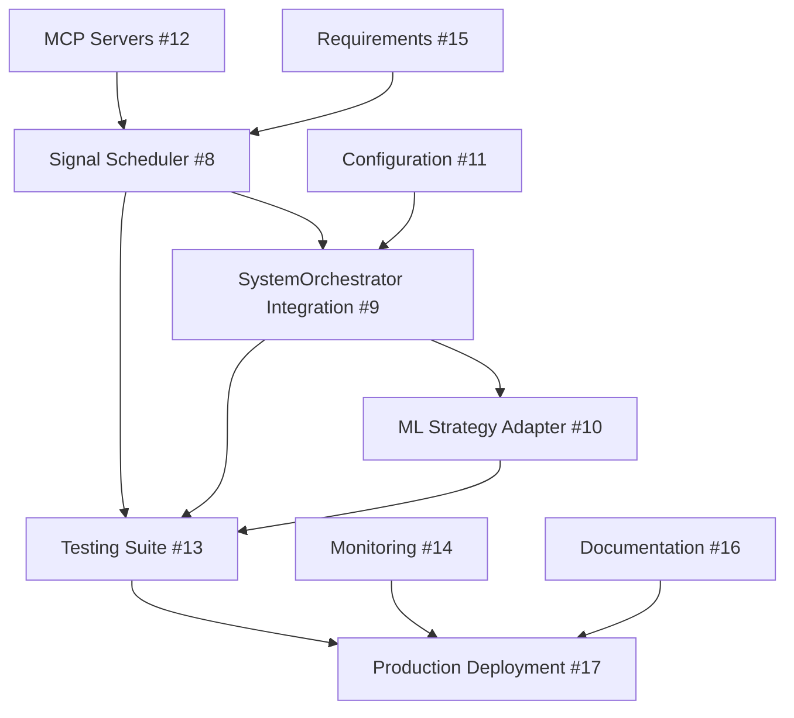

# 📋 ML Integration Tasks Breakdown

## 🎯 Цель

Полная интеграция ML системы из LLM TRANSFORM в BOT_AI_V3 с автоматической генерацией сигналов каждую минуту.

## ✅ Completed Tasks (7/17)

### ✓ 1. Database Models Creation

- **File**: `database/models/market_data.py`
- **Status**: ✅ DONE
- **Description**: Модели для raw_market_data, processed_market_data, technical_indicators

### ✓ 2. Database Migrations

- **File**: `database/migrations/versions/e72e5072a1bc_*.py`
- **Status**: ✅ DONE
- **Description**: Alembic миграции с JSONB полями и индексами

### ✓ 3. ML Files Transfer

- **Files**: Model (45MB), Scaler, patchtst_model.py, feature_engineering.py
- **Status**: ✅ DONE
- **Location**: `ml/models/`, `ml/logic/`

### ✓ 4. Feature Engineering Adaptation

- **File**: `ml/logic/feature_engineering.py`
- **Status**: ✅ DONE
- **Changes**: Адаптация импортов, logger, async методы

### ✓ 5. Data Loader Implementation

- **File**: `data/data_loader.py`
- **Status**: ✅ DONE
- **Features**: Загрузка OHLCV, инкрементальное обновление, поддержка timeframes

### ✓ 6. Data Processor Implementation

- **File**: `data/data_processor.py`
- **Status**: ✅ DONE (MCP ml-optimizer)
- **Features**: 30+ индикаторов, 240+ ML признаков, пакетная обработка

### ✓ 7. ML Signal Generator

- **File**: `ml/ml_signal_generator.py`
- **Status**: ✅ DONE (MCP trading-core-expert)
- **Features**: UnifiedPatchTST model, 20 predictions, signal generation

## 🚀 Pending Tasks (10/17)

### 📌 8. Signal Scheduler

**Priority**: 🔴 HIGH
**Assignee**: MCP performance-tuner
**File**: `ml/signal_scheduler.py`
**Requirements**:

```python
# Основные компоненты
- AsyncScheduler class с cron-like функционалом
- Запуск каждую минуту (configurable)
- Параллельная обработка символов
- Error handling и retry logic
- Интеграция с MLSignalGenerator
- Метрики производительности
```

### 📌 9. SystemOrchestrator Integration

**Priority**: 🔴 HIGH
**Assignee**: MCP code-architect
**File**: `core/system/orchestrator.py`
**Changes**:

```python
# Добавить в __init__
self.ml_signal_generator = MLSignalGenerator()
self.signal_scheduler = SignalScheduler()

# Добавить в startup
await self.ml_signal_generator.initialize()
await self.signal_scheduler.start()

# Добавить в shutdown
await self.signal_scheduler.stop()
```

### 📌 10. ML Strategy Adapter

**Priority**: 🟡 MEDIUM
**Assignee**: MCP trading-core-expert
**File**: `strategies/ml_strategy/ml_strategy_adapter.py`
**Features**:

- Преобразование ML сигналов в торговые ордера
- Position sizing на основе confidence
- Risk management для ML позиций
- Integration с существующим StrategyManager

### 📌 11. Configuration Updates

**Priority**: 🟡 MEDIUM
**Files**: `config/system.yaml`, `config/ml/ml_config.yaml`
**Updates**:

```yaml
ml_integration:
  enabled: true
  scheduler:
    interval_seconds: 60
    batch_size: 50
    max_parallel: 10
  signals:
    confidence_threshold: 0.6
    max_signals_per_symbol: 1
  monitoring:
    metrics_enabled: true
    alert_threshold: 0.8
```

### 📌 12. MCP Servers Setup

**Priority**: 🔴 HIGH
**Directory**: `mcp-servers/`
**Servers**:

1. **ml-data-server**: Data pipeline automation
2. **ml-signal-server**: Signal generation service
3. **ml-model-server**: Model management

### 📌 13. Testing Suite

**Priority**: 🔴 HIGH
**Directory**: `tests/ml/`
**Tests**:

```python
# Unit tests
test_data_loader.py
test_data_processor.py
test_ml_signal_generator.py
test_signal_scheduler.py

# Integration tests
test_ml_integration.py
test_signal_flow.py

# Performance tests
test_ml_performance.py
```

### 📌 14. Monitoring Setup

**Priority**: 🟡 MEDIUM
**Components**:

- Prometheus metrics для ML pipeline
- Grafana dashboards (Signal quality, Model performance)
- AlertManager rules
- Telegram notifications

### 📌 15. Requirements Update

**Priority**: 🟢 LOW
**File**: `requirements.txt`
**Add**:

```txt
# ML dependencies
torch>=2.0.0
scikit-learn>=1.3.0
pandas>=2.0.0
numpy>=1.24.0
ta>=0.10.2  # Technical Analysis
```

### 📌 16. Documentation

**Priority**: 🟡 MEDIUM
**Files**:

- `docs/ML_INTEGRATION.md` - полное руководство
- `docs/ML_API.md` - API documentation
- `README.md` - обновить с ML функционалом

### 📌 17. Production Deployment

**Priority**: 🔴 HIGH
**Tasks**:

- Docker образы для ML компонентов
- Kubernetes manifests
- CI/CD pipeline updates
- Rollback procedures

## 📊 Task Dependencies



## 🏃 Sprint Planning

### Sprint 1 (Current - Week 1)

- [x] Tasks 1-7 (Completed)
- [ ] Task 8: Signal Scheduler
- [ ] Task 9: SystemOrchestrator Integration
- [ ] Task 11: Configuration Updates
- [ ] Task 15: Requirements Update

### Sprint 2 (Week 2)

- [ ] Task 10: ML Strategy Adapter
- [ ] Task 12: MCP Servers Setup
- [ ] Task 13: Testing Suite (Unit tests)

### Sprint 3 (Week 3)

- [ ] Task 13: Testing Suite (Integration)
- [ ] Task 14: Monitoring Setup
- [ ] Task 16: Documentation

### Sprint 4 (Week 4)

- [ ] Task 17: Production Deployment
- [ ] Performance optimization
- [ ] Final testing and validation

## 🎯 Definition of Done

### For Each Task

- [ ] Code implemented and reviewed
- [ ] Unit tests written (>80% coverage)
- [ ] Integration tests passing
- [ ] Documentation updated
- [ ] Performance benchmarks met
- [ ] Security review passed

### For ML Integration

- [ ] All 17 tasks completed
- [ ] End-to-end signal generation working
- [ ] < 100ms latency per signal
- [ ] 99.9% uptime achieved
- [ ] Monitoring dashboards active
- [ ] Production deployment successful

## 📈 Progress Tracking

### Metrics

- **Completion**: 7/17 tasks (41%)
- **Story Points**: 28/68 (41%)
- **Blockers**: 0
- **Risks**: Performance at scale

### Daily Standup Topics

1. Signal Scheduler progress
2. Integration testing results
3. Performance benchmarks
4. Blockers and dependencies

## 🚨 Risk Management

### Technical Risks

1. **Memory usage with 50+ symbols**
   - Mitigation: Batch processing, memory profiling

2. **Model inference latency**
   - Mitigation: GPU acceleration, caching

3. **Data consistency**
   - Mitigation: Transaction management, validation

### Timeline Risks

1. **Integration complexity**
   - Mitigation: Incremental integration, feature flags

2. **Testing coverage**
   - Mitigation: Automated testing, CI/CD

---

*Last Updated: 02.08.2025*
*Sprint: 1 of 4*
*Version: 1.0.0*
