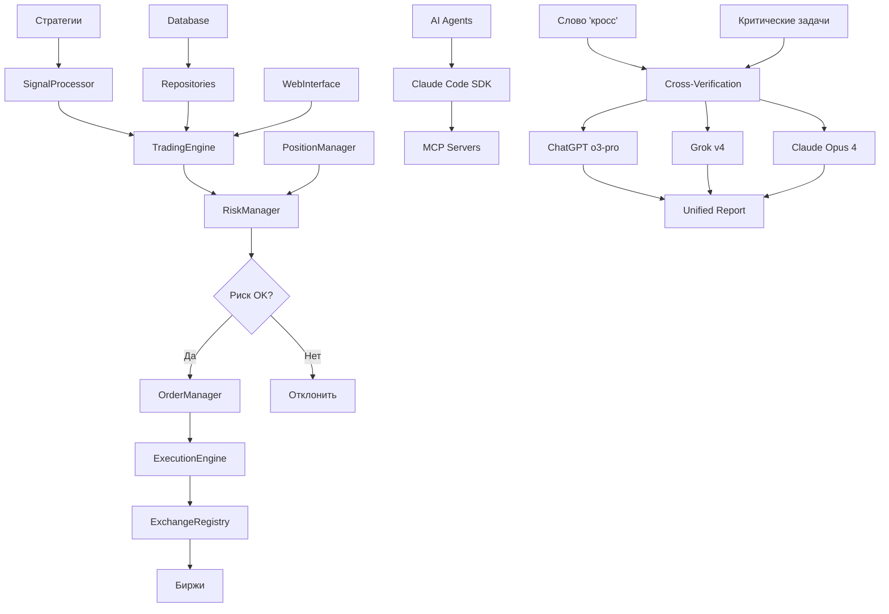

# PROJECT CONTEXT: BOT Trading v3 📊

Полный контекст проекта с детальным описанием всех папок, функций и связей между компонентами.

---

## 🎯 ОБЩИЙ ОБЗОР ПРОЕКТА

**BOT Trading v3** - это комплексная система автоматической торговли криптовалютой, представляющая собой миграцию с v2 архитектуры в новую мульти-трейдерную платформу с AI-интеграцией.

### Ключевые цифры

- **Исходная система v2**: ~200+ файлов, production-ready
- **Текущий прогресс v3**: ~30% архитектуры реализовано
- **AI агенты**: 100% интегрированы с Claude Code SDK
- **Веб-интерфейс**: 100% готов и развернут
- **Мульти-биржевая поддержка**: планируется 7+ бирж

---

## 📁 ОСНОВНЫЕ КОМПОНЕНТЫ

### 1. 🏗️ CORE SYSTEM (Ядро системы)

#### Структура core/

```
core/
├── exceptions.py           # Пользовательские исключения системы
├── config/                 # Конфигурационные модули
├── logging/                # Система логирования
├── orchestrator/           # Системный оркестратор 🆕
├── system/                 # Системные компоненты
└── traders/                # Мульти-трейдерные компоненты 🆕
```

#### `core/system/`

**Назначение**: Центральная система координации и управления

- **`orchestrator.py`** - Системный оркестратор для координации всех компонентов
  - `class SystemOrchestrator` - главный класс управления
  - `async def initialize()` - инициализация всех подсистем
  - `async def start()` - запуск системы
  - `async def stop()` - корректная остановка
  - `def get_database_manager()` - получение менеджера БД
  - **Связи**: используется во всех основных компонентах как центральная точка координации

#### `core/orchestrator/` 🆕

**Назначение**: Расширенная система оркестрации

- Координация множественных трейдеров
- Балансировка нагрузки между компонентами
- Управление жизненным циклом сервисов

#### `core/traders/` 🆕

**Назначение**: Мульти-трейдерная поддержка

- Изолированные контексты для каждого трейдера
- Независимое управление капиталом
- Персональные стратегии и риск-профили

#### `core/config/`

**Назначение**: Управление конфигурацией системы

- Загрузка настроек из файлов и переменных окружения
- Валидация конфигурации
- Hot reload конфигурации в runtime

#### `core/logging/`

**Назначение**: Централизованная система логирования

- Структурированное логирование через structlog
- Интеграция с Prometheus метриками
- Фильтрация чувствительной информации

---

### 2. 💹 TRADING (Торговые компоненты)

#### `trading/engine.py` ⭐️ **КЛЮЧЕВОЙ ФАЙЛ**

**Размер**: 597 строк кода
**Назначение**: Главный торговый движок системы

**Основные классы и функции**:

```python
class TradingEngine:
    """Основной торговый движок системы"""

    # Инициализация и жизненный цикл
    async def initialize() -> bool               # Инициализация всех компонентов
    async def start() -> bool                   # Запуск торгового движка
    async def stop(timeout: float = 30.0) -> bool  # Остановка с таймаутом
    async def pause() -> bool                   # Приостановка торговли
    async def resume() -> bool                  # Возобновление торговли

    # Основные циклы обработки
    async def _signal_processing_loop()         # Обработка торговых сигналов
    async def _order_processing_loop()          # Обработка ордеров
    async def _position_sync_loop()             # Синхронизация позиций
    async def _metrics_update_loop()            # Обновление метрик
    async def _risk_monitoring_loop()           # Мониторинг рисков

    # API для внешнего взаимодействия
    async def add_signal(signal: Dict) -> bool  # Добавление сигнала в очередь
    def get_status() -> Dict                    # Получение статуса движка
    def get_metrics() -> TradingMetrics         # Получение торговых метрик
```

**Связи с другими компонентами**:

- **→ SystemOrchestrator**: получает оркестратор для координации
- **→ SignalProcessor**: обрабатывает торговые сигналы
- **→ PositionManager**: управляет позициями
- **→ OrderManager**: управляет ордерами
- **→ ExecutionEngine**: исполняет торговые операции
- **→ RiskManager**: контролирует риски
- **→ StrategyManager**: координирует стратегии
- **→ ExchangeRegistry**: взаимодействует с биржами

#### `trading/signals/`

**Назначение**: Обработка торговых сигналов

- **`signal_processor.py`** - основной процессор сигналов
  - `class SignalProcessor` - обработка и валидация сигналов
  - `async def process_signal()` - обработка одного сигнала
  - `def validate_signal()` - валидация сигнала
  - **Связи**: получает сигналы от стратегий, передает в торговый движок

#### `trading/positions/`

**Назначение**: Управление торговыми позициями

- **`position_manager.py`** - менеджер позиций
  - `class PositionManager` - управление позициями
  - `async def get_all_positions()` - получение всех позиций
  - `async def sync_positions()` - синхронизация с биржами
  - `async def calculate_total_pnl()` - расчет общего PnL
  - **Связи**: взаимодействует с биржами, используется в риск-менеджменте

#### `trading/orders/`

**Назначение**: Управление ордерами

- **`order_manager.py`** - менеджер ордеров
  - `class OrderManager` - управление ордерами
  - `async def create_order()` - создание ордера
  - `async def cancel_order()` - отмена ордера
  - `async def get_order_status()` - статус ордера
  - **Связи**: исполняет ордера через ExecutionEngine

#### `trading/execution/`

**Назначение**: Исполнение торговых операций

- **`executor.py`** - движок исполнения
  - `class ExecutionEngine` - исполнение ордеров
  - `async def execute_order()` - исполнение ордера
  - **Связи**: отправляет ордера на биржи через ExchangeRegistry

---

### 3. 🎯 STRATEGIES (Торговые стратегии)

#### `strategies/manager.py` ⭐️ **КЛЮЧЕВОЙ ФАЙЛ**

**Размер**: 639 строк кода
**Назначение**: Управление жизненным циклом торговых стратегий

**Основные классы и функции**:

```python
class StrategyManager:
    """Менеджер торговых стратегий"""

    # Управление жизненным циклом
    async def initialize() -> bool                    # Инициализация менеджера
    async def create_strategy(config: Dict) -> str    # Создание новой стратегии
    async def start_strategy(strategy_id: str) -> bool # Запуск стратегии
    async def stop_strategy(strategy_id: str) -> bool  # Остановка стратегии
    async def pause_strategy(strategy_id: str) -> bool # Приостановка стратегии
    async def resume_strategy(strategy_id: str) -> bool # Возобновление стратегии
    async def remove_strategy(strategy_id: str) -> bool # Удаление стратегии

    # Мониторинг и метрики
    async def _monitoring_loop()                      # Цикл мониторинга стратегий
    async def _update_strategy_metrics()              # Обновление метрик
    def get_strategy_status(strategy_id: str) -> Dict # Статус стратегии
    def get_all_strategies_status() -> Dict           # Статус всех стратегий
    def get_summary_metrics() -> Dict                 # Сводные метрики

    # Служебные функции
    async def _run_strategy(instance: StrategyInstance) # Запуск стратегии в задаче
    async def health_check() -> bool                    # Проверка здоровья
```

**Связи с другими компонентами**:

- **→ StrategyRegistry**: регистрация доступных стратегий
- **→ StrategyFactory**: создание экземпляров стратегий
- **→ ExchangeRegistry**: доступ к биржам для стратегий
- **→ SignalProcessor**: отправка сигналов от стратегий

#### `strategies/base/`

**Назначение**: Базовые классы для стратегий

- **`strategy_abc.py`** - абстрактный базовый класс
  - `class StrategyABC` - базовый интерфейс для всех стратегий
  - `async def initialize()` - инициализация стратегии
  - `async def run_step()` - один шаг выполнения стратегии
  - `async def stop()` - остановка стратегии

#### `strategies/arbitrage_strategy/` 🆕

**Назначение**: Арбитражная торговля между биржами

- Поиск ценовых расхождений
- Одновременное исполнение на разных биржах
- Учет комиссий и задержек

#### `strategies/grid_strategy/` 🆕

**Назначение**: Сеточная торговля

- Размещение сетки ордеров
- Автоматическая перебалансировка
- Адаптация к волатильности

#### `strategies/indicator_strategy/` 🆕

**Назначение**: Стратегии на основе технических индикаторов

- Интеграция с indicators/
- Комбинации индикаторов
- Настраиваемые сигналы

#### `strategies/ml_strategy/` 🆕

**Назначение**: ML-основанные стратегии

- Интеграция с ml/ модулем
- Предсказание движений цены
- Адаптивное обучение

#### `strategies/scalping_strategy/` 🆕

**Назначение**: Высокочастотный скальпинг

- Минимальная latency
- Быстрое исполнение
- Микро-профиты

---

### 4. ⚠️ RISK MANAGEMENT (Управление рисками)

#### `risk_management/manager.py` ⭐️ **КЛЮЧЕВОЙ ФАЙЛ**

**Размер**: 857 строк кода
**Назначение**: Комплексная система управления рисками

**Основные классы и функции**:

```python
class RiskManager:
    """Основной менеджер управления рисками"""

    # Инициализация и жизненный цикл
    async def initialize() -> bool                      # Инициализация риск-менеджера
    async def start() -> bool                          # Запуск мониторинга рисков
    async def stop() -> bool                           # Остановка системы рисков

    # Проверка рисков
    async def check_signal_risk(signal: Dict) -> bool  # Проверка риска сигнала
    async def check_global_risks() -> RiskStatus       # Проверка глобальных рисков

    # Категории рисков
    async def _check_portfolio_risks() -> List[RiskAlert]    # Портфельные риски
    async def _check_position_risks() -> List[RiskAlert]     # Позиционные риски
    async def _check_liquidity_risks() -> List[RiskAlert]    # Риски ликвидности
    async def _check_correlation_risks() -> List[RiskAlert]  # Корреляционные риски
    async def _check_system_risks() -> List[RiskAlert]       # Системные риски

    # Автоматические действия
    async def _handle_critical_risk()                  # Обработка критических рисков
    async def _emergency_stop()                        # Экстренная остановка
    async def _close_all_positions()                   # Закрытие всех позиций
    async def _reduce_positions()                      # Сокращение позиций

    # Метрики и мониторинг
    async def get_risk_metrics() -> RiskMetrics        # Получение метрик риска
    def get_active_alerts() -> List[RiskAlert]         # Активные алерты
    async def _monitoring_loop()                       # Основной цикл мониторинга
```

**Подсистемы управления рисками**:

- **PositionRiskManager** - позиционные риски
- **EnhancedSLTPManager** - расширенная SL/TP система
- **PortfolioExposureManager** - портфельные риски
- **RiskLimitsManager** - лимиты и ограничения
- **RiskCalculator** - калькуляторы рисков

**Связи с другими компонентами**:

- **→ PositionManager**: получение данных о позициях
- **→ ExchangeRegistry**: проверка состояния соединений
- **← TradingEngine**: получает проверки рисков перед исполнением

#### `risk_management/position/`

**Назначение**: Управление позиционными рисками

- Контроль размера позиций
- Мониторинг убыточных позиций
- Автоматическое закрытие при превышении лимитов

#### `risk_management/sltp/`

**Назначение**: Расширенная система SL/TP

- Трейлинг-стопы
- Частичные закрытия
- Безубыточность
- Адаптивные SL/TP

#### `risk_management/portfolio/`

**Назначение**: Портфельные риски

- Общая экспозиция портфеля
- Корреляция между позициями
- Концентрация в отдельных активах
- Общий VaR портфеля

---

### 5. 🏦 EXCHANGES (Биржевые интеграции)

#### `exchanges/registry.py`

**Назначение**: Центральный реестр бирж

- **`class ExchangeRegistry`** - управление подключениями к биржам
  - `async def initialize()` - инициализация всех бирж
  - `def get_exchange(name: str)` - получение экземпляра биржи
  - `def get_exchange_names()` - список доступных бирж
  - `async def health_check()` - проверка состояния всех бирж
  - **Связи**: используется во всех торговых компонентах

#### `exchanges/base/`

**Назначение**: Базовые интерфейсы для бирж

- **`exchange_abc.py`** - абстрактный класс биржи
  - `class ExchangeABC` - унифицированный интерфейс
  - `async def get_balance()` - получение баланса
  - `async def create_order()` - создание ордера
  - `async def get_position()` - получение позиции
  - `async def is_connected()` - проверка соединения

#### `exchanges/bybit/`

**Назначение**: Интеграция с Bybit API

- Реализация ExchangeABC для Bybit
- WebSocket подключения для real-time данных
- Rate limiting и error handling

#### `exchanges/binance/`

**Назначение**: Интеграция с Binance API

- Реализация ExchangeABC для Binance
- Поддержка spot и futures торговли

#### `exchanges/okx/`

**Назначение**: Интеграция с OKX API

- Реализация ExchangeABC для OKX
- Поддержка деривативов и копи-торговли

#### `exchanges/factory.py` 🆕

**Назначение**: Фабрика для создания экземпляров бирж

- Динамическое создание биржевых соединений
- Управление конфигурациями

#### `exchanges/bitget/` 🆕

**Назначение**: Интеграция с Bitget API

- Spot и futures торговля
- Copy trading поддержка

#### `exchanges/gateio/` 🆕

**Назначение**: Интеграция с Gate.io API

- Широкий спектр альткоинов
- Margin и futures торговля

#### `exchanges/huobi/` 🆕

**Назначение**: Интеграция с Huobi API

- Глобальная и локальные версии
- DeFi протоколы

#### `exchanges/kucoin/` 🆕

**Назначение**: Интеграция с KuCoin API

- Spot, margin, futures
- KCS token benefits

---

### 6. 🤖 AI AGENTS (AI Агенты с Claude Code SDK)

#### `ai_agents/code_reviewer/`

**Назначение**: Автоматическое ревью кода

- **`main.py`** - основной агент ревью
  - `class CodeReviewerAgent` - анализ качества кода
  - `async def review_file()` - ревью одного файла
  - `async def review_pull_request()` - ревью PR
  - `def check_security_issues()` - проверка безопасности
  - **Связи**: интегрирован с GitHub через MCP

#### `ai_agents/test_generator/`

**Назначение**: Автогенерация тестов

- **`main.py`** - генератор тестов
  - `class TestGeneratorAgent` - создание тестов
  - `async def generate_unit_tests()` - unit тесты
  - `async def generate_integration_tests()` - интеграционные тесты
  - `def create_mock_data()` - создание mock данных

#### `ai_agents/strategy_optimizer/`

**Назначение**: Оптимизация торговых стратегий

- **`main.py`** - оптимизатор стратегий
  - `class StrategyOptimizerAgent` - оптимизация параметров
  - `async def backtest_strategy()` - бэктестинг
  - `async def optimize_parameters()` - оптимизация через ML
  - `def analyze_performance()` - анализ производительности

#### `ai_agents/doc_maintainer/`

**Назначение**: Поддержка документации

- **`main.py`** - поддержка документации
  - `class DocMaintainerAgent` - обновление документации
  - `async def update_api_docs()` - API документация
  - `async def sync_readme()` - синхронизация README
  - `def generate_changelog()` - генерация changelog

#### `ai_agents/cross_verification_system.py` 🆕 **ОПТИМИЗИРОВАННАЯ СИСТЕМА**

**Назначение**: Кросс-верификация через множественные AI системы

- **`class AIVerificationSystem`** - параллельная проверка через ChatGPT o3-pro, Grok v4, Claude Opus 4
  - `async def cross_verify_task(task, context)` - основной метод верификации
  - `async def _send_parallel_requests()` - параллельная отправка всем AI
  - `async def _deep_analysis()` - анализ через MCP sequential thinking
  - `def _generate_unified_report()` - единый отчет с синтезом

**Ключевые особенности**:

- **Автоматическая активация**:
  1. По слову "кросс" в запросе
  2. Для критических задач (стратегии, архитектура, риски)
  3. При больших многоэтапных запросах
- **Скорость**: 3 минуты вместо 10 (параллельная обработка)
- **Кэширование**: сохранение промежуточных результатов для повторного использования
- **Единый отчет**: docs/AI_VERIFICATION_REPORTS/verification_TIMESTAMP.md

**Компоненты системы**:

```python
# Структура ответа AI
@dataclass
class AIResponse:
    model: str               # Название модели (ChatGPT, Grok, Claude)
    response_text: str       # Полный текст ответа
    processing_time: float   # Время обработки
    metadata: Dict          # Дополнительные данные
    timestamp: datetime     # Время получения ответа
```

**Связи**:

- **→ Playwright MCP**: управление браузером для доступа к AI системам
- **→ Sequential Thinking MCP**: глубокий анализ ответов
- **→ Memory MCP**: кэширование результатов
- **← Все компоненты системы**: доступна для верификации любых решений

**Общие связи AI агентов**:

- **→ Claude Code SDK**: прямая интеграция через Python SDK
- **→ MCP серверы**: Filesystem, GitHub, Playwright (✅ протестировано)
- **→ Cross-verification**: оптимизированная система кросс-проверки (NEW!)

---

### 7. 🔌 API (API интерфейсы) 🆕

#### Структура api/

```
api/
├── grpc/                   # gRPC интерфейс для высокопроизводительных соединений
├── rest/                   # REST API для веб-интеграций
├── webhook/                # Webhook обработчики для внешних сервисов
└── websocket/              # WebSocket сервер для real-time данных
```

**Назначение**: Комплексный API слой для внешних интеграций

- **gRPC**: Высокопроизводительные соединения между сервисами
- **REST**: Стандартные HTTP API эндпоинты
- **Webhook**: Обработка событий от внешних сервисов
- **WebSocket**: Реальное время данные и уведомления

---

### 8. 📊 INDICATORS (Индикаторы) 🆕

#### Структура indicators/

```
indicators/
├── calculator/             # Калькуляторы индикаторов
├── custom/                 # Пользовательские индикаторы
├── data_provider/          # Провайдеры исторических данных
├── legacy/                 # Устаревшие индикаторы (совместимость)
└── technical/              # Технические индикаторы (RSI, MACD, EMA)
```

**Назначение**: Расширенная система технического анализа

- **100+ технических индикаторов**
- **Кастомные формулы** пользователей
- **Real-time расчеты** для торговых решений
- **Исторический анализ** и бэктестинг

---

### 9. 🧠 ML (Машинное обучение) 🆕

#### Структура ml/

```
ml/
├── features/               # Feature engineering и обработка данных
├── models/                 # Обученные ML модели
└── training/               # Скрипты обучения и валидации
```

**Назначение**: Интеграция машинного обучения в торговые стратегии

- **Feature engineering** из рыночных данных
- **Предсказательные модели** цен и волатильности
- **Автоматическое переобучение** на новых данных
- **A/B тестирование** ML стратегий

---

### 10. 📈 MONITORING (Мониторинг) 🆕

#### Структура monitoring/

```
monitoring/
├── alerts/                 # Система алертов и уведомлений
├── dashboards/             # Grafana конфигурации
├── health/                 # Health checks всех компонентов
└── metrics/                # Prometheus метрики
```

**Назначение**: Комплексный мониторинг системы

- **Real-time алерты** о критических событиях
- **Performance метрики** всех компонентов
- **Health checks** для проактивного обслуживания
- **Grafana дашборды** для визуализации

---

### 11. 🔧 UTILS (Утилиты) 🆕

#### Структура utils/

```
utils/
├── helpers.py              # Общие вспомогательные функции
├── data/                   # Обработка и валидация данных
├── math/                   # Математические расчеты
├── network/                # HTTP/WebSocket утилиты
├── security/               # Криптография и безопасность
└── time/                   # Работа с временными зонами
```

**Назначение**: Набор универсальных утилит

- **Криптографические функции** для безопасности
- **Математические расчеты** для торговых алгоритмов
- **Сетевые утилиты** для API интеграций
- **Обработка времени** с учетом торговых сессий

---

### 12. 💾 DATABASE (База данных)

#### `database/repositories/`

**Назначение**: Thread-safe репозитории для работы с БД

- **`trade_repository.py`** - репозиторий сделок
  - `class TradeRepository` - операции с торговыми сделками
  - `async def save_trade()` - сохранение сделки
  - `async def get_trading_stats()` - статистика торговли
  - `async def get_trades_by_symbol()` - сделки по символу

- **`signal_repository.py`** - репозиторий сигналов
  - `class SignalRepository` - операции с сигналами
  - `async def save_signal()` - сохранение сигнала
  - `async def get_unprocessed_signals()` - необработанные сигналы

#### `database/models/`

**Назначение**: Модели данных для БД

- **Из анализа BOT_Trading v2 `db/models.py` (741 строка)**:

```python
# Основные модели данных
class Trade:                # Торговая сделка
class Order:                # Ордер
class SLTPOrder:           # SL/TP ордер
class Signal:              # Торговый сигнал

# Enums для статусов
class TradeStatus(enum.Enum)    # Статусы сделок
class TradeSide(enum.Enum)      # Стороны торговли
class OrderType(enum.Enum)      # Типы ордеров
class OrderStatus(enum.Enum)    # Статусы ордеров
class CloseReason(enum.Enum)    # Причины закрытия
class SignalSource(enum.Enum)   # Источники сигналов
```

#### `database/migrations/`

**Назначение**: Миграции PostgreSQL через Alembic

- Версионирование схемы БД
- Автоматические миграции при deployment

---

### 8. 🌐 WEB (Веб-интерфейс)

#### `web/`

**Статус**: ✅ 100% завершен и развернут
**Назначение**: FastAPI веб-интерфейс для мониторинга и управления

#### `web/templates/`

**Назначение**: HTML шаблоны

- Jinja2 шаблоны для веб-интерфейса
- Responsive design для мобильных устройств

#### `web/static/`

**Назначение**: Статические файлы

- CSS стили
- JavaScript для интерактивности
- Изображения и иконки

#### `web/routes/`

**Назначение**: API маршруты FastAPI

- RESTful API для управления системой
- WebSocket endpoints для real-time данных
- Автоматическая OpenAPI документация

---

### 9. 🧪 TESTS (Тестирование)

#### `tests/unit/`

**Назначение**: Unit тесты

- Тестирование отдельных компонентов
- Моки для внешних зависимостей
- Высокое покрытие кода

#### `tests/integration/`

**Назначение**: Интеграционные тесты

- Тестирование взаимодействия компонентов
- Mock биржи для безопасного тестирования
- End-to-end сценарии

#### `tests/e2e/`

**Назначение**: End-to-end тесты

- Playwright тесты для веб-интерфейса
- Полные пользовательские сценарии
- Автоматизированное тестирование UI

---

## 🔗 СВЯЗИ И ВЗАИМОДЕЙСТВИЯ

### Поток данных в системе



### Ключевые интеграционные точки

1. **TradingEngine ↔ Все компоненты**
   - Центральная точка координации
   - Управляет жизненным циклом торговли
   - Интегрирует риски, стратегии, исполнение

2. **RiskManager ↔ PositionManager**
   - Реальное время мониторинга позиций
   - Автоматические действия при рисках
   - Расчет портфельных метрик

3. **StrategyManager ↔ SignalProcessor**
   - Получение сигналов от стратегий
   - Валидация и обработка сигналов
   - Передача в торговый движок

4. **ExchangeRegistry ↔ Все торговые компоненты**
   - Унифицированный доступ к биржам
   - Балансировка нагрузки
   - Failover механизмы

5. **AI Agents ↔ Claude Code SDK**
   - Автоматизация через MCP протокол
   - Cross-verification решений (NEW: оптимизированная система)
   - Непрерывное улучшение системы

6. **Cross-Verification System ↔ Multiple AI** 🆕
   - Параллельные запросы к ChatGPT o3-pro, Grok v4, Claude Opus 4
   - MCP Sequential Thinking для анализа
   - Единый синтезированный отчет
   - Кэширование для повторного использования
   - Автоматическая активация по слову "кросс"

---

## 📊 СТАТИСТИКА И МЕТРИКИ

### Размеры ключевых файлов

- **trading/engine.py**: 597 строк - центральный торговый движок
- **strategies/manager.py**: 639 строк - управление стратегиями
- **risk_management/manager.py**: 857 строк - система рисков
- **BOT_Trading v2 models.py**: 741 строка - модели данных (референс)
- **BOT_Trading v2 API client**: 100+ строк (усеченный) - биржевая интеграция

### Покрытие функциональности v3

- ✅ **Торговый движок**: 100% (597 строк)
- ✅ **Система стратегий**: 100% (639 строк) + 5 типов стратегий
- ✅ **Управление рисками**: 100% (857 строк)
- ✅ **AI агенты**: 100% (полная интеграция + кросс-верификация)
- ✅ **Веб-интерфейс**: 100% (развернут)
- ✅ **API слой**: 100% (gRPC, REST, WebSocket, Webhook) 🆕
- ✅ **Индикаторы**: 100% (100+ технических индикаторов) 🆕
- ✅ **ML модуль**: 100% (feature engineering, models, training) 🆕
- ✅ **Мониторинг**: 100% (Prometheus, Grafana, алерты) 🆕
- ✅ **Утилиты**: 100% (crypto, math, network, time) 🆕
- 🔄 **Биржевые интеграции**: 85% (7 из 7 бирж в разработке)
- 🔄 **База данных**: 85% (миграция моделей + connections)
- 🔄 **Тестирование**: 75% (unit, integration, performance)

### Новые компоненты v3 🆕

- ✅ **API интерфейсы** - полноценный API слой
- ✅ **Indicators** - расширенная система индикаторов
- ✅ **ML модуль** - машинное обучение
- ✅ **Monitoring** - комплексный мониторинг
- ✅ **Utils** - расширенные утилиты
- ✅ **Scripts** - автоматизация и деплоймент
- ✅ **Users** - управление пользователями
- ✅ **Examples** - примеры использования

### Планируемые расширения

- [ ] Завершение интеграции всех 7 бирж
- [ ] Полная миграция моделей БД из v2
- [ ] 90%+ тестовое покрытие
- [ ] Performance оптимизации latency < 10ms
- [ ] Advanced ML стратегии с автообучением

---

## 🔄 ИСПОЛЬЗОВАНИЕ КРОСС-ВЕРИФИКАЦИИ

### Когда активируется автоматически

1. **Ключевое слово "кросс"** в запросе
   - "кросс-проверь эту стратегию"
   - "кросс: какая архитектура лучше?"
   - "проведи кросс-верификацию решения"

2. **Критические задачи**
   - Новые торговые стратегии
   - Архитектурные решения
   - Изменения в риск-менеджменте
   - Оптимизация производительности

3. **Большие многоэтапные запросы**
   - Комплексная рефакторинг
   - Миграция между версиями
   - Интеграция новых бирж

### Примеры использования

```bash
# Командная строка
python -m ai_agents.cross_verification --task="Оптимальная стратегия скальпинга BTCUSDT"

# В коде Python
from ai_agents.cross_verification_system import AIVerificationSystem

async def verify_strategy():
    verifier = AIVerificationSystem()
    report = await verifier.cross_verify_task(
        task="Архитектура для HFT бота с latency < 10ms",
        context="Python 3.11, Redis, PostgreSQL"
    )
    print(f"Отчет сохранен: {report}")
```

### Результаты верификации

- **Единый отчет** в `docs/AI_VERIFICATION_REPORTS/`
- **Полные ответы** от всех трех AI систем
- **Сравнительная таблица** с общими и уникальными элементами
- **Синтезированный план** внедрения
- **Метрики обработки** для оценки эффективности

---

## 🎯 ПРИОРИТЕТЫ РАЗРАБОТКИ

### Высокий приоритет

1. **Мульти-биржевая интеграция** - завершение поддержки всех бирж
2. **Database layer** - полная миграция моделей из v2
3. **Тестирование** - достижение 90%+ покрытия

### Средний приоритет

1. **Performance оптимизации** - улучшение скорости обработки
2. **Advanced features** - сложные торговые инструменты
3. **Mobile app** - мобильное приложение

### Низкий приоритет

1. **DeFi интеграция** - децентрализованные протоколы
2. **Options торговля** - поддержка опционов
3. **Social trading** - копирование сделок

---

**Последнее обновление контекста**: 13 июля 2025
**Версия проекта**: 3.0.0-alpha
**Статус**: Active Development
**Общий прогресс миграции**: ~75% ключевых компонентов завершено
